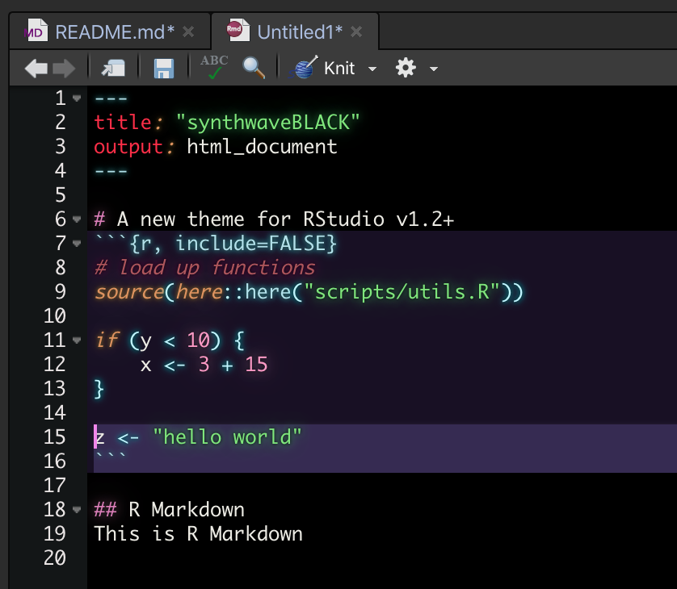

# synthwaveBLACK

RStudio v1.2+ allows for custom themes via a `.rstheme` file.

This theme is losely based on the [Synthwave85 RStudio theme](https://github.com/jnolis/synthwave85) , but with a pure black background for OLED screens.
Colors were diversified to my tastes, but I utilized the same methodology for creating the subtle glow effect.

## Installation
To install this theme,

1. Ensure you have the latest version of RStudio (at least v1.2, which was [released in April of 2019](https://blog.rstudio.com/2019/04/30/rstudio-1-2-release/))
2. Ensure you have the `rstudioapi` package installed.
3. Run this one line of code, `rstudioapi::addTheme("https://raw.githubusercontent.com/roshandarji/synthwaveBLACK/master/SynthwaveBlack.rstheme", TRUE, TRUE, FALSE)`

## Change Theme / Uninstallation

### Change Theme

To change your current theme, You can select your desired Theme by going to `Tools > Global Options > Appearance > Editor theme`

### Uninstallation

To uninstall **synthwaveBLACK** (removing it from the list of available Themes), Execute the following code:

`rstudioapi::removeTheme("SynthwaveBLACK")`

## Issues
If any areas of the theme seem off/weird, feel free to let me know under the `Issues` tab.

## Citation
I've copied and made extremely minor changes to the [README.MD of the Synthwave85 RStudio theme](https://github.com/jnolis/synthwave85/blob/master/readme.md).
The wording and format in which the information was provided was good, so I saw no reason to change it.
